# 🎙️ Meeting & Sales Intelligence Agent
### *Autonomous Meta-Intelligence Orchestration for Business Conversations*

[](https://github.com/Ismail-2001)
[](https://github.com/Ismail-2001)
[](https://github.com/Ismail-2001)
[](LICENSE)

---

## 🎬 Project Overview
The **Meeting Intelligence Agentic Platform** is a modular, multi-agent AI system designed to transform raw business conversations into high-impact actionable intelligence. Unlike basic transcription tools, this platform utilizes a **Meta-Intelligence Orchestration layer** to autonomously route tasks to specialized agents for decision extraction, sales qualification (MEDDIC/BANT), and workflow optimization. 

---

## 🏗️ Technical Architecture
The platform follows a sophisticated **Planner-Executor-Synthesizer** pattern to ensure cross-functional coherence.

```mermaid
graph TD
    Input[🎧 Audio / Transcript] --> Orch[🧠 Meta-Orchestrator]
    
    subgraph "Planning Layer"
    Orch --> Plan[Intent Analysis & Routing]
    end
    
    subgraph "Execution Layer (Parallel)"
    Plan --> M1[📁 Meeting Intelligence Agent]
    Plan --> M2[📈 Sales Intelligence Agent]
    Plan --> M3[⚙️ Workflow Automation Agent]
    end
    
    M1 -->|Decisions & Tasks| Synthesis
    M2 -->|MEDDIC / Health Score| Synthesis
    M3 -->|Automation Specs| Synthesis
    
    subgraph "Synthesis Layer"
    Synthesis[🎯 Intelligence Synthesis]
    end
    
    Synthesis --> Output[📦 Structured JSON Intelligence]

    style Orch fill:#1a1a2e,stroke:#00ff00,color:#fff
    style Plan fill:#1a1a2e,stroke:#00bfff,color:#fff
    style Synthesis fill:#1a1a2e,stroke:#cc66ff,color:#fff
```



---

## ✨ Key Features
| Feature | Description |
| :--- | :--- |
| **Multi-Agent Orchestrator** | An intelligent conductor that determines the optimal execution path based on user intent. |
| **Executive Summary Agent** | Extracts C-suite summaries and action items with weighted importance. |
| **Sales Intelligence (MEDDIC)** | Real-time analysis of sales calls using **MEDDIC** and **BANT** frameworks with deal health scoring. |
| **Workflow Automation Agent** | Identifies manual processes and generates Python-based automation code and ROI projections. |
| **Provider Agnostic** | Unified client for **DeepSeek**, **Kimi (Moonshot AI)**, **Claude 3.5**, and **GPT-4o**. |
| **Machine-Readable Outputs** | Strict JSON delivery for seamless CRM (Salesforce/HubSpot) integration. |

---

## 📊 Sales Intelligence (MEDDIC) Output Example
```json
{
  "deal_health_score": 85,
  "meddic_metrics": {
    "metrics": "Customer expects 20% efficiency increase",
    "economic_buyer": "Identified: CTO (Sarah Chen)",
    "decision_criteria": "Security, Scalability, ROI < 6 months",
    "decision_process": "Technical audit followed by board approval",
    "identify_pain": "Lead leakage in current manual CRM entry",
    "champion": "Highly engaged: Mark (Sales Ops Lead)"
  },
  "next_best_action": "Schedule technical deep-dive with Sarah Chen by Friday."
}
```

---

## 🏁 Quick Start
### Prerequisites
- Python 3.10+
- API Keys for your preferred provider (DeepSeek, OpenAI, etc.)

### Installation
```bash
git clone https://github.com/Ismail-2001/Meeting-Intelligence-Agent.git
cd Meeting-Intelligence-Agent
pip install -r requirements.txt
```

### Usage
Run the orchestration engine:
```bash
python main.py --transcript ./meeting_transcript.txt
```

---

## 🗺️ Roadmap
- [ ] Integration with real-time Zoom/Teams webhooks.
- [ ] Multi-speaker diarization refinement.
- [ ] Automatic Jira/Trello card generation from action items.
- [ ] Dashboard for historical deal health tracking.

---

### 🔗 Connecting the Intelligence
Developed by **[Ismail Sajid](https://ismail-sajid-agentic-portfolio.netlify.app/)**.
*Explore more Autonomous Agents on my [Main Profile](https://github.com/Ismail-2001).*

⭐ **Star this repo if you find it useful!**
